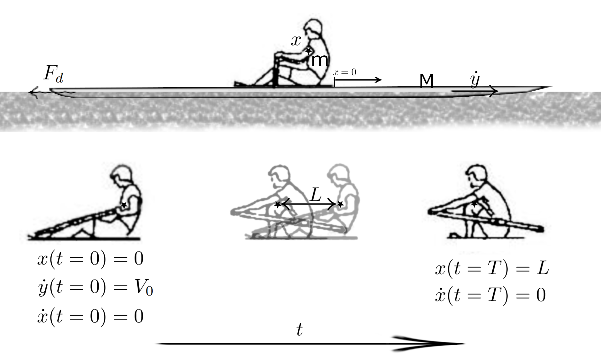
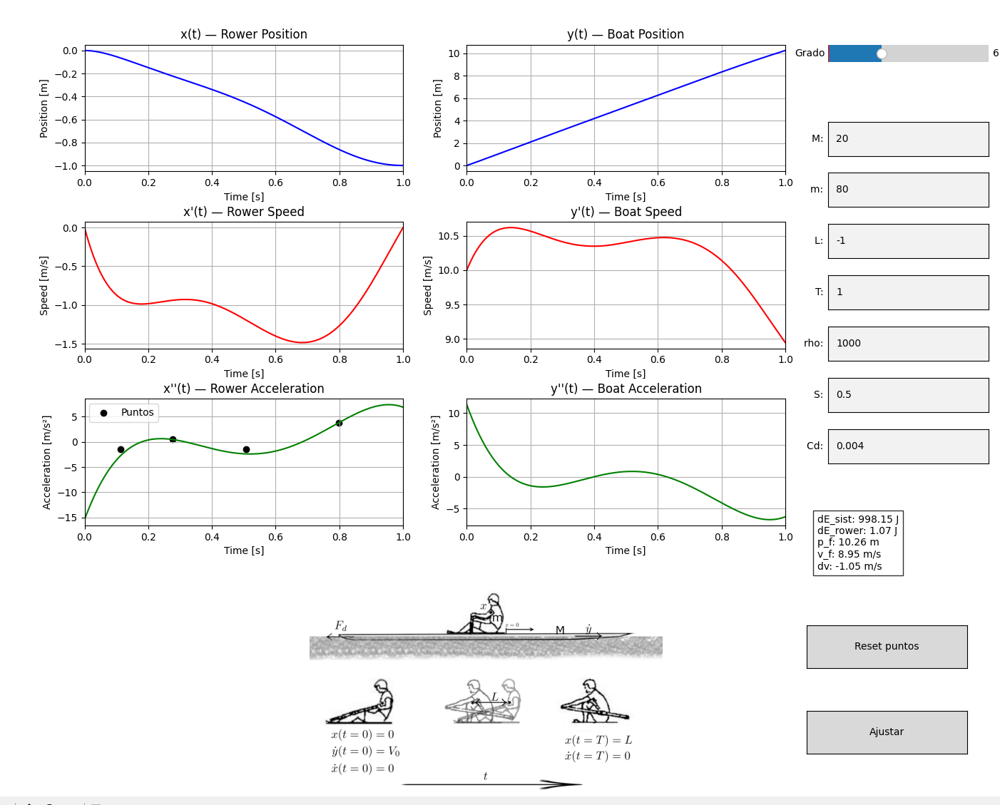
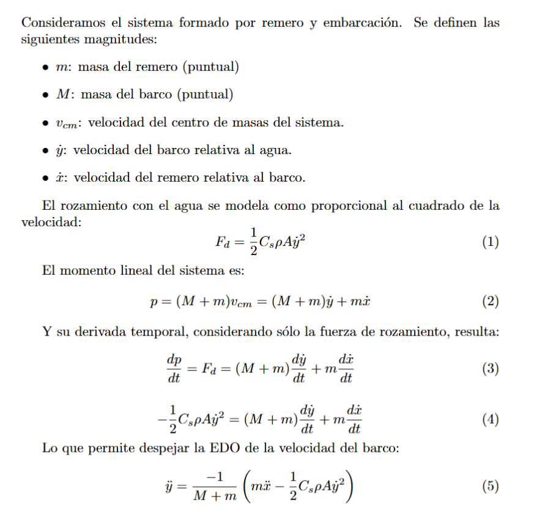

# 🛶 Sistema Físico Remero–Barco–Agua 1D  



---

## 📘 Descripción General

Este proyecto modela y simula el **sistema físico unidimensional remero–barco–agua** durante la **fase aérea de la modalidad de remo de banco móvil**.  
El propósito es ofrecer una herramienta **interactiva** que permita estudiar la dinámica del conjunto, controlando directamente la **cinemática del remero** durante la fase de recuperación.




El usuario define un **polinomio libre** que describe la posición del remero a lo largo del tiempo.  
El programa **impone automáticamente las condiciones de contorno físicas** para garantizar una transición suave (posición, velocidad y aceleración nulas al inicio y fin del ciclo).




---

## 🧠 Fundamento Matemático

### 🔹 Dinámica general del sistema

El sistema se compone de:

- **Remero** de masa \( m_r \)
- **Barco** de masa \( m_b \)
- **Rozamiento** con el agua caracterizado por \( k \)

Las ecuaciones de movimiento durante la **fase aérea** (sin interacción pala–agua) son:

$$
\begin{cases}
m_r \ddot{x}_r = F_{int}(x_r, x_b) \\
m_b \ddot{x}_b = -F_{int}(x_r, x_b) - k \dot{x}_b
\end{cases}
$$

donde \( F_{int} \) representa la fuerza interna entre remero y embarcación.  
Durante esta fase, la pala no transmite fuerza al agua, por lo que el sistema se comporta como un conjunto cerrado con intercambio de momento entre sus partes.

---

### 🔹 Polinomio que cumple las condiciones de contorno

Se desea construir un polinomio \( p(t) \) de grado \( n \ge 3 \) que cumpla:

$$
p(0) = 0, \quad p(T) = L, \quad p'(0) = 0, \quad p'(T) = 0
$$

donde:
- \( T \): duración total de la fase aérea  
- \( L \): desplazamiento total relativo del remero respecto al barco  

#### Forma general del polinomio
Sea:

$$
p(t) = a_0 + a_1t + a_2t^2 + a_3t^3 + \cdots + a_n t^n
$$

Aplicando las condiciones iniciales \( p(0) = 0 \) y \( p'(0) = 0 \), se obtiene:

$$
a_0 = 0, \quad a_1 = 0
$$

por lo que:

$$
p(t) = a_2t^2 + a_3t^3 + a_4t^4 + \cdots + a_n t^n
$$


#### Condiciones finales en \( t = T \)

$$
\begin{cases}
a_2T^2 + a_3T^3 + \sum_{k=4}^{n} a_k T^k = L \\
2a_2T + 3a_3T^2 + \sum_{k=4}^{n} k a_k T^{k-1} = 0
\end{cases}
$$

Resolviendo para \( a_2 \) y \( a_3 \):

$$
\begin{aligned}
a_2 &= \frac{3L}{T^2} + \sum_{k=4}^{n} (k - 3)a_k T^{k-2} \\
a_3 &= -\frac{2L}{T^3} - \sum_{k=4}^{n} (k - 2)a_k T^{k-3}
\end{aligned}
$$

#### Solución general

$$
p(t) = a_2t^2 + a_3t^3 + \sum_{k=4}^{n} a_k t^k
$$

Los coeficientes \( a_4, \ldots, a_n \) son libres y determinan la forma del perfil cinemático.  
Los coeficientes \( a_2 \) y \( a_3 \) se ajustan automáticamente para garantizar las condiciones de frontera.

#### Caso mínimo: polinomio cúbico
Si \( n = 3 \):

$$
p(t) = \frac{3L}{T^2}t^2 - \frac{2L}{T^3}t^3
$$

Este es el **perfil cúbico único** que satisface las condiciones básicas.

---

## 🎮 Interactividad y Uso

El archivo principal `src/interactive.py` lanza una **interfaz interactiva** que permite:

1. **Definir la cinemática del remero**  
   - Elegir el **grado del polinomio**.  
   - Ajustar los **coeficientes libres** manualmente o mediante clics sobre el gráfico (para “dibujar” la forma del movimiento).

2. **Configurar parámetros físicos**
   - Masa del remero \( m_r \)
   - Masa del barco \( m_b \)
   - Coeficiente de rozamiento \( k \)

3. **Ejecutar la simulación**
   - Visualizar la evolución temporal de posiciones, velocidades y aceleraciones.
   - Observar la influencia del perfil de movimiento en la dinámica del sistema.

4. **Analizar resultados**
   - Energía cinética total y energía relativa.
   - Potencia desarrollada por el remero y eficiencia del movimiento.

---

## ⚙️ Ejemplo de Ejecución

```bash
# Clonar el repositorio
git clone https://github.com/abelBEDOYA/olympic-rowing-dynamics-analysis.git

cd olympic-rowing-dynamics-analysis/

conda create -n row python==3.12.0

pip install -r requirements.txt

# Ejecutar la aplicación interactiva
python src/interactive.py
